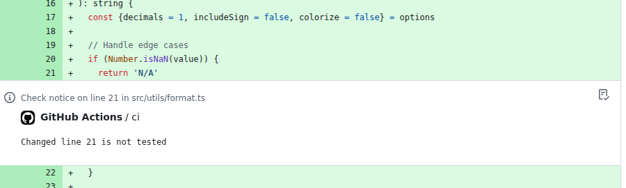
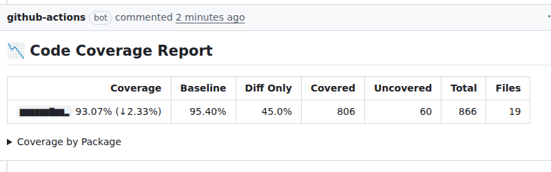

# Code Coverage Annotation

Annotate pull requests with lines missing test coverage. Catch gaps as they're introduced, right in the context of the PR.

All processing runs within GitHub Actions—no data is sent to external servers.





## Quick Start

```yaml
- name: Code Coverage
  uses: sgrankin/codecoverage@v1
  with:
    github_token: ${{secrets.GITHUB_TOKEN}}
    coverage_file_path: coverage/lcov.info
```

See [docs/examples.md](docs/examples.md) for language-specific setup and advanced configurations.

## Inputs

| Input | Required | Default | Description |
| ----- | -------- | ------- | ----------- |
| `github_token` | **yes** | - | GitHub token from workflow (`${{secrets.GITHUB_TOKEN}}`) |
| `coverage_file_path` | **yes** | - | Path to coverage file(s). Supports globs and newline-separated paths. |
| `coverage_format` | no | `lcov` | Format: `lcov`, `cobertura`, `go`, or `simplecov` |
| `working_directory` | no | `.` | Project directory relative to workspace root. For `go` format, locates `go.mod` and prefixes entry paths to match PR diff paths. |
| `pr_comment` | no | `false` | Post coverage summary as PR comment |
| `comment_id` | no | `''` | Namespace for the PR comment; jobs with different ids keep separate comments |
| `report_header` | no | `Code Coverage Report` | Custom header text for coverage reports |
| `step_summary` | no | `true` | Write summary to GitHub Actions step summary |
| `max_annotations` | no | `10` | Maximum annotations to emit |
| `max_lookback` | no | `50` | Max ancestor commits to search for baseline |
| `sparkline_count` | no | `10` | Historical data points in coverage sparkline (0 to disable) |
| `mode` | no | auto | `pr-check` or `store-baseline` (see below) |
| `main_branch` | no | `main` | Branch whose pushes store coverage baselines |
| `calculate_delta` | no | `true` | Calculate coverage delta against baseline |
| `github_base_url` | no | `https://api.github.com` | API URL for GitHub Enterprise |
| `coverage_api` | no | `false` | Upload the report to GitHub's code coverage API (see below) |
| `coverage_api_language` | no | - | Linguist language name (e.g. `TypeScript`). Required when `coverage_api` is enabled. |
| `coverage_api_label` | no | `code-coverage` | Label identifying the uploaded report |

## Outputs

| Output | Description |
| ------ | ----------- |
| `coverage_percentage` | Overall line coverage (e.g., `85.50`) |
| `statement_percentage` | Overall statement coverage (Go only; empty for other formats) |
| `coverage_delta` | Change vs baseline for the primary metric (e.g., `+2.50`) |
| `baseline_percentage` | Baseline for the primary metric, from git notes |
| `files_analyzed` | Number of files with coverage data |
| `annotation_count` | Annotations created for uncovered lines |
| `mode` | Operating mode used |

For Go coverage, the report uses **statement coverage** throughout (matching `go tool cover -func`) — headline, delta, sparkline, counts, and package table — with a footnote noting the line figure. Line coverage is still reported via `coverage_percentage`.

## Coverage Delta

Track coverage changes over time using git notes:

1. **Push to main** → stores coverage as baseline; the job summary shows the delta and sparkline against the stored history
2. **Pull request** → compares against baseline, shows delta

To track a branch other than `main` (a different default branch, or a long-running feature branch), set `main_branch`; baselines are namespaced per branch, and PRs targeting that branch compare against its baseline.

Requires `contents: write` permission and `fetch-depth: 0`:

```yaml
permissions:
  contents: write
  pull-requests: write
steps:
  - uses: actions/checkout@v4
    with:
      fetch-depth: 0
```

## GitHub Coverage API

GitHub can show coverage results natively on pull requests via its
[code coverage feature](https://docs.github.com/en/code-security/how-tos/maintain-quality-code/set-up-code-coverage)
(public preview, part of GitHub Code Quality). Set `coverage_api: true` and
this action uploads the parsed report there too — converted to Cobertura XML
regardless of the input format, so it works with lcov, Go, and SimpleCov
coverage as well.

```yaml
permissions:
  code-quality: write
steps:
  - name: Code Coverage
    uses: sgrankin/codecoverage@v1
    with:
      github_token: ${{secrets.GITHUB_TOKEN}}
      coverage_file_path: coverage/lcov.info
      coverage_api: true
      coverage_api_language: TypeScript
```

Run the workflow on both `pull_request` and pushes to the default branch —
GitHub compares PR uploads against the default branch's baseline. Merge queue
runs and fork PRs are skipped automatically, and upload failures (e.g. the
repository doesn't have code quality enabled) log a warning without failing
the run.

## Contributing

See [CONTRIBUTING.md](CONTRIBUTING.md) for development setup.

## Acknowledgements

Fork of [ggilder/codecoverage](https://github.com/ggilder/codecoverage), originally based on [shravan097/codecoverage](https://github.com/shravan097/codecoverage).
